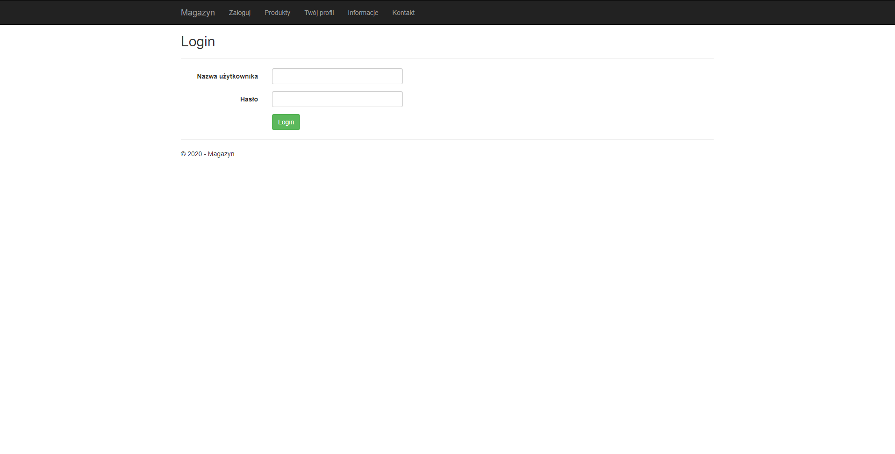
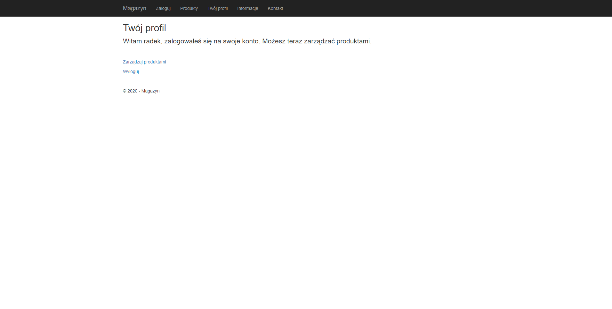
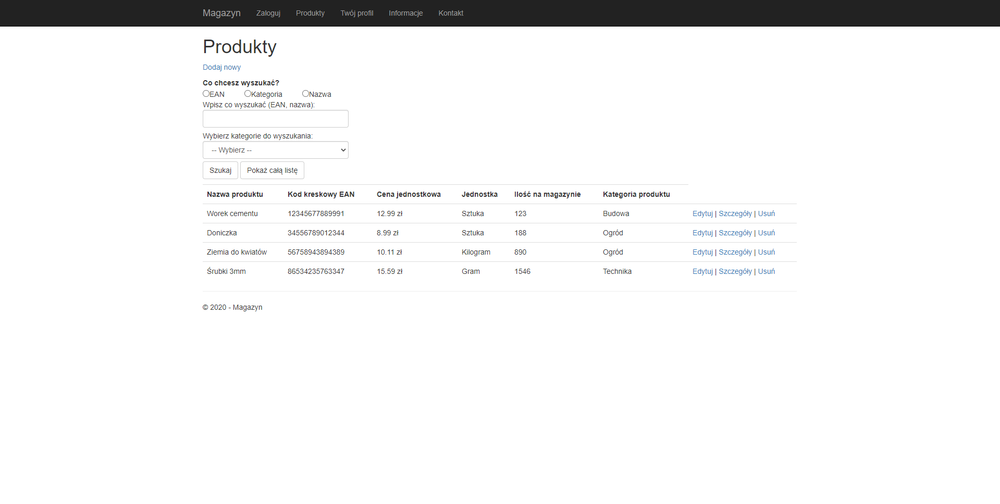
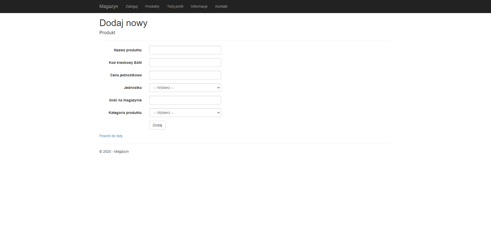

# WebApp
A web application for managing a warehouse.  
In this application you can do every CRUD functionalities and search for name, EAN or category of product saved in database.  
Before managing products, you have to login into account saved in database (it is properly secured to prevent management before logging in).  
Project created in Miscrosoft Visual Studio, ASP.NET Web. 
Below some screenshots of application.   
  
  
  
  
